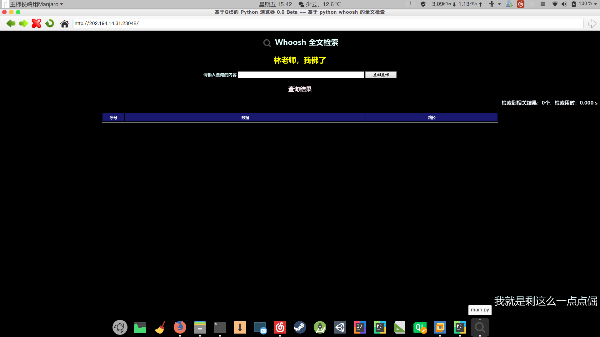

# 使用PyQt5以及QWebEngineView构建网页浏览器

### 基本构想
* 浏览器中的普通网页无法使用pgpy
* 用python/pgpy写一个http协议客户端
* 可以通过Python实现的一个浏览器然后截获其中的GET和POST命令进行加密传输
* 比如说202.194.14.31:23048的查询网站，可以通过这个方式进行加密传输
* 使用Qt5进行图形界面的绘制，通过调用控件的基本函数来实现操作

### 界面设计
* 因为浏览器的组件相对较少，因此可以不用Qt设计师进行界面的绘制，直接在.py文件中导入PyQt5模块进行编写即可。

#### 窗体设计
* 在窗口的标题栏上显示程序名称以及网页的标题，同时图标设置成为网页的图标（也就是favico）

#### 顶栏
* 后退按钮
* 前进按钮
* 停止按钮
* 刷新按钮
* 主页按钮
* 地址栏
* 转到按钮

#### 超文本浏览框
* 这是整个程序最核心的地方，显示浏览的界面以及响应各种请求，同时与python进行交互。

#### 状态栏
* 进度条，显示网页加载的进度。



### 关于QWebEngineView的介绍与说明
* pyqt5 已经抛弃 QtWebKit和QtWebKitWidgets，而使用最新的QtWebEngineWidgets。
* QtWebEngineWidgets，是基于chrome浏览器内核引擎的。
* PyQt5使用QWebEngineView控件来展示HTML页面，对老版本的QWebView类不在进行维护，因为QWebEngineView使用CHromium内核可以给用户带来更好的体验。
* QWebEngineView控件使用load（）函数加载一个Web页面，实际上就是使用HTTP Get方法加载web页面，这个控件可以加载本地的web页面，也可以加载外部web页面。
* 注意使用QWebEngineView对象的setHTML（）函数渲染HTml页面时，如果页面中使用的JavaScript代码超过2M，程序渲染就会失败。

### 简单功能实现
#### 主窗体绘制
* 程序的init函数为启动函数，通过设定窗体的大小，标题，图标等等可以实现窗体的绘制。

```
def __init__(self, *args, **kwargs):
    super().__init__(*args, **kwargs)
    # 窗体
    self.setWindowTitle(self.name + self.version)
    self.setWindowIcon(QIcon('Assets/main.png'))
    self.resize(1200, 800)
    # 浏览器窗体
    self.browser = QWebEngineView()
    self.browser.load(QUrl("http://www.hao123.com/"))
    self.setCentralWidget(self.browser)
```

#### 工具条实现
* 工具条实现

```
# 工具条
navigation_bar = QToolBar('Navigation')
navigation_bar.setIconSize(QSize(32, 32))
self.addToolBar(navigation_bar)
```
 
* 工具条按钮以及地址栏

``` 
# 后退按钮
back_button = QAction(QIcon('Assets/back.png'), '后退', self)
# 其他组件
self.url_text_bar = QLineEdit()
```

* 将组件添加到工具条

```
navigation_bar.addAction(home_button)
navigation_bar.addSeparator()
navigation_bar.addWidget(self.url_text_bar)
```

* 工具条按钮触发事件

```
# 事件触发
back_button.triggered.connect(self.browser.back)
```

* 获取网页标题

```
def renew_title(self, s):
    self.setWindowTitle(self.name + self.version + " -- " + s)
```

* 获取网页图标
 
```
def renew_icon(self, ico):
    self.setWindowIcon(ico)
```

* 导向地址栏地址

```
def navigate_to_url(self):
    s = QUrl(self.url_text_bar.text())
    if s.scheme() == '':
        s.setScheme('http')
    self.browser.load(s)
```

* 地址栏重新操作

```
def renew_urlbar(self, s):
    self.url_text_bar.setText(s.toString())
    self.url_text_bar.setCursorPosition(0)
```

### 多窗口功能实现
* 其中，最让纠结的就是实现左键点击页面跳转了。
* 在chrome浏览器上，有些页面，左键点击，会直接创建一个新的tab来呈现网页。
* 在使用QWebEngineView时，如果不做特殊处理，这样的左键点击，是根本没有反应的。
所以需要重写QWebEngineView的createWindow方法。

#### 第一种，是直接在本窗口新建标签的方式。（这种方式有个问题，因为新建的tab覆盖了原来的tab，所以，原来tab的所有信息都找不到了，如浏览，账号，密码等。）
 
#### 第二种，新建窗口的方式。
 
### 多标签页功能的实现
* 之前提到了创建新窗口的实现方法。
* 但是现代浏览器很少有像IE6一样的多窗口样式的。
* 而是使用QTabWidget，创建新的tab来实现，这样更加符合浏览器的设计。

#### 创建标签和关闭标签
 
#### 多标签重写函数

